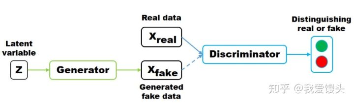
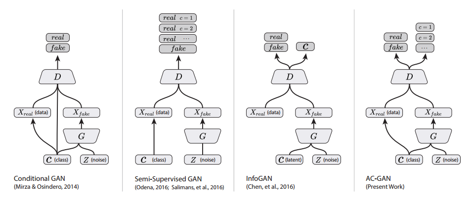

# text2draw

## 概述：GAN的基本结构
### 基本GAN
结构图如下 
 
隐变量z通常是高斯噪声，判别器进行二分类，判断是真还是假的，通常采用交叉熵损失。 
    训练过程中，生成器与判别器交叉训练，先训练D再G。迭代训练K次判别器，再迭代一次生成器， 
当生成器G固定时，求导计算最优D。最优判别器带入目标函数可以求出在当前D下生成器的目标函数。 
二者达到纳什均衡后，判别器的预测概率为50%，即难以区分真假。

### ACGAN
采用监督方法训练的模型，将分类标签和z作为生成器的输入，生成的假图片输入判别器，判别器判断真假和类别 
 

### 实验记录
使用google quick draw数据集，数据读出来以后大小都是640x480大小，因此输入网络的图片也要比较大才能保证 
图上画的东西看得清
